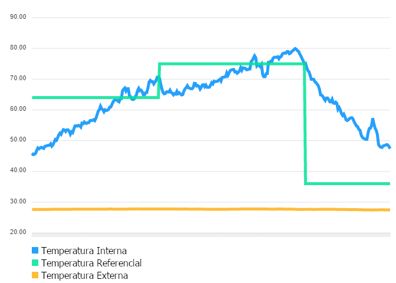
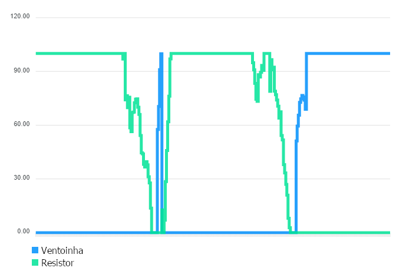

# Fundamentos de Sistemas Embarcados - Projeto 1
## Integrantes
| Matrícula | Aluno |
| -- | -- |
| 17/0114040  |  Samuel de Souza Buters Pereira |

## Compilação
Para a compilação do projeto, execute:
> make all

O projeto será compilado no arquivo project.bin que estará na pasta raíz do projeto.  

Logo, após a compilação, para executar o projeto, execute:
> ./project.bin

Para limpar o diretório, execute:
> make clean

## Uso
Ao executar o projeto, é possível escolher a fonte da temperatura referencial a partir do menu inicial.  

Pressionar a tecla 1 utilizará o potenciômetro e começará a execução do loop principal do projeto.  

Pressionar a tecla 2 irá permitir o usuário a inserir um valor a ser usado como temperatura referencial e começará a execução do loop principal do projeto.  
 
Não é necessário pressionar Enter ao escolher uma das opções no menu principal.  

No loop principal, a execução pode ser parada com Ctrl + C (SIGINT). Após o término, um arquivo data.csv conterá dados referentes às temperaturas e aos atuadores do sistema.  

## Screenshots
Segue abaixo gráficos correspondendo a execução do loop principal por aproximadamente 10 minutos.

### Gráfico das temperaturas

### Gráfico dos atuadores

## Outros
No diretório /www, foi codificada uma ferramenta para auxiliar a geração dos gráficos.  

Para executá-la, suba um servidor http local a partir do diretório /www e acesse-o em algum navegador.  
Um exemplo utilizando http.server segue com a execução do seguinte comando:
> python -m http.server 8080

Em seguida, acesse localhost:8080.  

Ao inserir os dados do csv, retire a última quebra de linha.